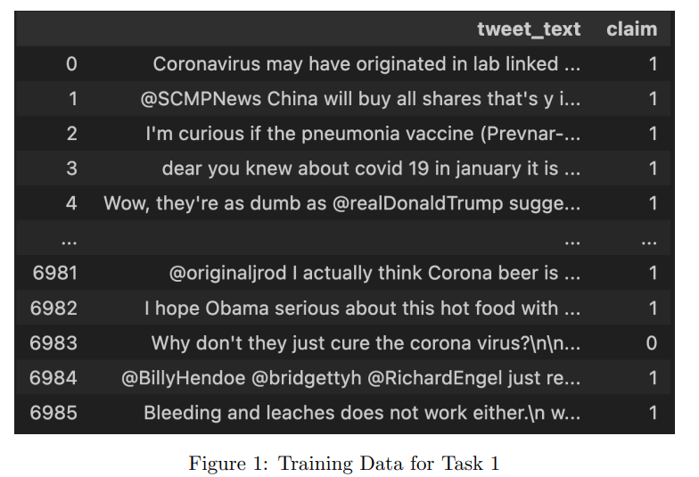
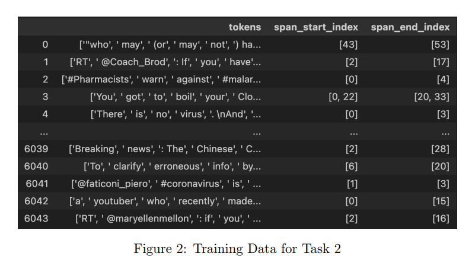
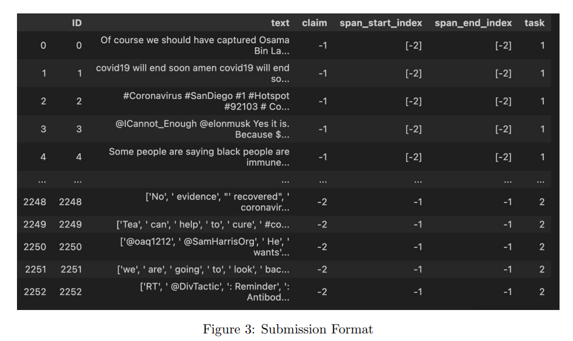

# Fighting Against Fake News (ARIES-IITD’s hackathon)
## 1. Overview
The Hackathon was focused on AI for Social
Good, specifically tailored to address the urgent challenge of combating fake news.

In an era where misinformation spreads faster than ever, the need for innovative and
effective solutions is paramount. Our mission is to harness the power of Artificial Intelligence
to create tools that can differentiate between fact and fiction, contributing positively to the
discourse on social media and beyond.

Countering fake news is an essential social service for several reasons:
<ul>
<li>Promotes Informed Decision-Making: Individuals and Organizations help ensure
that the public has access to accurate and reliable information, enabling them to make
informed decisions.</li>

<li>Protects Public Health: Ensures that people receive accurate guidance on preventive
measures, treatments, and vaccine information.</li>

<li>Safeguards Democracy: The dissemination of false information can undermine the
democratic process by influencing elections and public opinion through misinformation.
Hence, it becomes essential to combat fake news.</li>
</ul>

## 2. Problem Statement

The problem statement for this Hackathon revolves around developing Machine Learning
models capable of detecting and identifying claims in social media posts. It is hosted on
Kaggle. Participants will be working on two critical tasks:

**Claim Detection:** The first task involves binary classification, where participants will
determine whether a given piece of text from a social media post is making a claim
or not. This task is essential for filtering noise and focusing on potentially misleading
information.

**Claim:** A claim is a statement or assertion that presents information as being true, factual,
or at least worthy of acceptance or belief. Claims are often made to express an opinion, convey
a fact, or argue a point.

Examples:"The Great Wall of China is visible from space.” : Factual  | "Vaccines cause autism.” : Fake

**Claim Span Identification:** It is a critical task in the process of fact-checking and
misinformation analysis, focusing on precisely locating the specific segment of text that
constitutes a claim within a larger body of text.

## 3. Used Transfer Learning with BERT

## 4. Plan Of action

